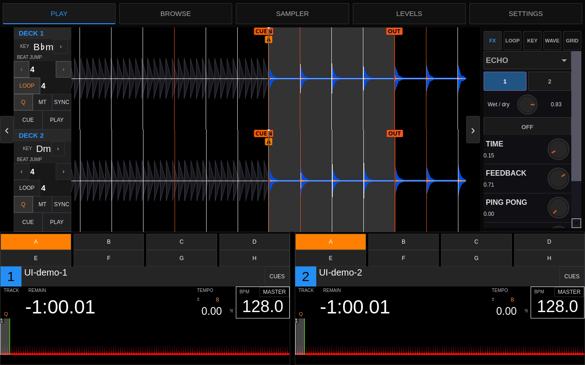
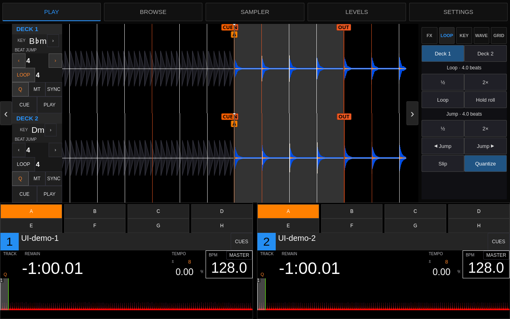

# AZ-inspired BiteDJ play layout

Select **Settings → Display → Main View → AZ**. This is a two-deck BiteDJ layout
built with the existing Qt skin controls and waveform renderer. It does not load
firmware, copied firmware images, or an AZ audio engine. Other view choices remain
available; the selected view is saved.

## Implemented

- Two stacked scrolling waveforms and two full-track overviews, with BiteDJ's
  existing hot/memory cue marks, saved-loop ranges and phrase strip.
- Large per-deck elapsed/remaining time (tap to switch), current BPM, tempo offset
  and range, track number, title/filename fallback, artist, key and master state.
- Per-deck touch play/cue, beat jump with editable size, loop start/exit with
  editable size, quantize, master tempo/keylock and sync. The master selector is
  bound to BiteDJ's sync-leader control.
- Eight live A–H hot-cue pads per deck. The CUES button opens the existing full
  drawer for the memory bank and editing/deletion. Small pads deliberately omit
  the destructive corner badge.
- Five compact right-rail tabs: **FX, Loop, Key, Wave, Grid**. Each page scrolls
  if needed without changing the waveform or deck-card height.
- FX exposes the native effect selector, deck routing, an interactive wet/dry
  knob and value, effect enable, every loaded continuous parameter and loaded
  parameter switch. Parameter names, ranges and scaling come from the effect.
  The previous reciprocal beat buckets were removed: their labels were wrong
  for period-based effects such as Echo. Values now show native numeric units;
  there is no universal musical beat-length preset or AZ DSP emulation.
- Loop has its own explicit Deck 1/2 selector, loop size halve/double, loop
  start/exit, momentary roll, jump size halve/double, backward/forward jump,
  slip and quantize. This selection does not change controller deck routing.
- Key shows both decks' current keys and semitone offsets, with single-semitone
  shifts, keylock, harmonic match and reset.
- Wave exposes linked zoom with a live readout, waveform height presets and
  fixed/EQ-following drawing. Grid exposes each deck's file BPM, beat position
  nudges/set-to-playhead, small BPM adjustments and half/double BPM.
- **Independent collapsible sides:** the left handle hides both deck-information
  rails, the right handle hides the FX/tools panel. Both handles remain available
  when collapsed. Waveforms expand into the space; their renderer widgets are
  reused. Both choices survive restart and also apply to the other play layouts.
- The full cue drawer keeps the AZ play area at the same height as the closed
  deck cards. The normal top-level Play/Browse/Sampler/Levels/Settings navigation
  retains its original control keys, including the Settings recording state.

The existing FLX6 mapping files are untouched. Physical controller behavior and
Pi touch have not been tested by this desktop pass.

## Boundaries and remaining AZ parity

This is the initial full **two-deck** layout, not complete AZ feature parity.
Four-deck and mixed 2/4-deck views, source/media badges, native-style phase and
bar-count displays, and the exact AZ FX/X-pad interface remain follow-up work.
BiteDJ's effects and sync semantics still apply; the skin does not implement AZ
DSP, streaming accounts, cloud services or source-library features. Imported
metadata must exist before it can be displayed. Time uses BiteDJ's actual format
and precision, not decorative three-digit milliseconds.

The reference was the user's preserved AZ play screenshots. All new skin widgets
and styling are original source; no proprietary image assets are added. The
existing summary XML was extracted into a shared template so the new and legacy
cards retain the same cue/loop and phrase behavior.

## Desktop verification

`os/tests/test_az_play_app.py` launches the real app in Xvfb with Mesa software
OpenGL, an ALSA null output and two disposable synthesized 128 BPM tracks. It
clicks the actual widgets, checks panel visibility and waveform geometry/identity,
checks time mode, quantize/keylock, loop start/exit, beat jump and hot-cue state,
opens the existing cue/zoom/grid controls, switches between AZ and native layouts,
checks the new loop/jump sizes, deck isolation, key shift/reset, live zoom,
waveform height selection, grid BPM half/double, native Echo parameter and
wet/dry changes, and scrolling to the final effect switches. It then restarts
the app to check collapsed-state persistence. It saves screenshots,
logs and the tested executable hash. Null output is not a physical playback or
real-time audio benchmark.

```sh
python3 os/tests/test_az_play_app.py --build /path/to/build \
  --output /path/to/results --xvfb /path/to/Xvfb
env QT_QPA_PLATFORMTHEME= QT_STYLE_OVERRIDE=Fusion \
  python3 os/tests/test_deck_presentation.py
```

The actual-app test exposed an existing `WNumberPos` bug: its ControlProxy omits
notifications to the setter, so tapping changed the saved time mode and other
copies of the readout, but not the clicked readout. The click handler now reads
back the accepted mode and refreshes itself. The small presentation fixture now
models this self-notification suppression too; it previously broadcast changes
back to the setter and missed the defect.

Verified desktop run: all app checks above passed, including restart persistence
and returning to the original 180px deck strip after switching layouts. With the enlarged 44px rail handles at
1280×800, waveform width is 836px expanded, 962px with the left rail hidden,
and 1192px with both sides hidden. The presentation fixture also passed.

Target screenshot size is 1280×800. Physical touch hit accuracy, narrow-screen
fit, four-deck behavior and Pi CPU/RAM/frame-time measurements remain unverified.

## Performance rail previews

Actual desktop app with synthesized test tracks:





## FLX6 navigation and touch follow-up

A physical-screen report found unreliable FLX6 Browse/View after folding the
right rail and a left rail that would not collapse. The shipping XML bound VIEW
(`96 7A`) directly to the skin's toggle control even though the script already
contained a select-only `viewPressed` handler. Repeated VIEW could therefore
close Browse. The XML now calls that handler; BACK, encoder acceleration,
Shift/zoom and other controller bindings are unchanged.

Both collapse buttons now have 44×88px touch targets (previously 30×60px).
Desktop window-routed touch contacts collapse/reopen both rails, preserve their
independent state across Browse/Play, and retain the AZ layout. The app test also
sends repeated Browse control writes without clicking the Browse tab, modelling
the mapped VIEW action. It uses the trigger's real ControlProxy and supplies the
external-change notification suppressed when that proxy is itself the setter.
The JS workflow test checks the actual XML binding and press/release/encoder
sequences with both rail states. These are simulated inputs, not physical MIDI.

The left rail's reported failure has **not** been reproduced on the desktop.
The larger touch target is a usability improvement, not proof that this symptom
is resolved. Next Pi check: tap each rail, press/release VIEW repeatedly, turn
the FLX6 encoder in both sidebar and track-list views, and confirm the very first
step moves the selection. The Pi was off during this follow-up; these changes
are not deployed there yet.

```sh
node os/tests/test_flx6_workflow.cjs
```
